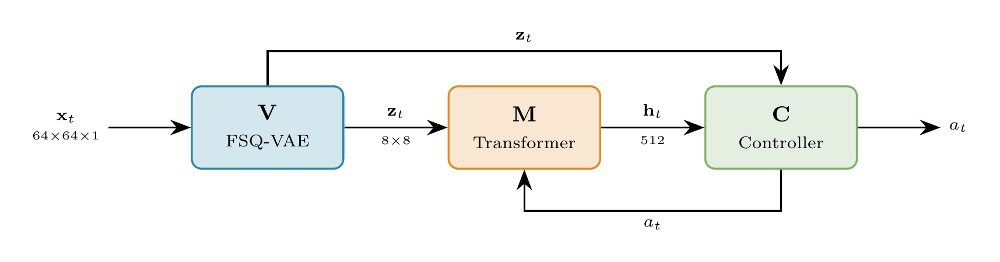

# DeepDash

**World Models for Geometry Dash** -- Train a controller entirely in imagination, deploy at 30 FPS on the real game via screen capture.

## Architecture



| Component | Model | Params | Function |
|-----------|-------|--------|----------|
| **V** (Vision) | FSQ-VAE [8,5,5,5] | 1.9M (0.9M encoder) | 64x64 Sobel frame -> 8x8 discrete tokens (1000 codes) |
| **M** (Memory) | Transformer 512d/8H/8L | 25.9M | Predicts next tokens + death, produces h_t |
| **C** (Controller) | CNNPolicy + MTP | ~50K | Token grid + h_t -> jump/idle (+ 8-step action prediction) |

## Latest Results (V3)

| Metric | V1 | V2 | V3 (current) |
|--------|-----|-----|-------------|
| Transformer params | 6.7M | 6.7M | 25.9M |
| Val accuracy | 36.1% | 34.2% | 36.6% |
| Death F1 (val) | 0.72 | 0.73 | 0.78 |
| BC val acc | 78% | 83.6% | 90% |
| Level 1 progress | 10% | 11% | 20% |
| Inference | 27ms | 24ms | ~27ms |

## Novel Contributions

- **FSQ-structured label smoothing**: Gaussian kernel over FSQ coordinate distance instead of uniform smoothing
- **Real-time World Models deployment**: screen capture agent on a real game at 30 FPS (no game API)

## Pipeline

```
1. Record gameplay    ->  data/death_episodes/, data/expert_episodes/
2. Train FSQ-VAE      ->  checkpoints/fsq_best.pt
3. Tokenize episodes  ->  tokens.npy per episode
4. Train Transformer  ->  checkpoints/transformer_best.pt
5. BC pretrain        ->  checkpoints/controller_bc_best.pt
6. PPO finetune       ->  checkpoints/controller_ppo_best.pt
7. Deploy             ->  python scripts/deploy.py
```

## Data

- **Death episodes**: ~3,600 episodes, ~179K frames (intentional deaths at obstacles)
- **Expert episodes**: ~36 clean runs, ~33K frames (no deaths, for BC + world model rebalancing)
- Global episode-level train/val split shared across all models (`deepdash/data_split.py`)

## Training Details

### FSQ-VAE
- RMSE 0.025/pixel, 100% codebook utilization
- GRWM regularization, shift augmentation, cosine LR, 200 epochs on A100

### Transformer
- Block-causal attention + 3D-RoPE + AC-CPC weight 1.0 (TWISTER)
- Focal loss + structured label smoothing (sigma=0.9) + dual token noise
- Vertical-only shift augmentation (5x), death oversample 5x
- No masking (all target tokens predicted, no ground truth leakage)
- 512d embedding, 8 heads, 8 layers, dropout 0.15
- 200 epochs, LR 2e-3, batch 512

### Controller
- **BC**: death + expert episodes, class-weighted BCE (1.5x jumps), early stopping
- **PPO**: clipped surrogate + MTP auxiliary loss (8-step), jump penalty 0.2/jump, percentile-based advantage normalization, EMA target critic (0.98), 45-step dream rollouts, constant LR 1e-4

### Deployment
- Screen capture (dxcam) -> Sobel (7ms, GPU) -> FSQ encode (4ms) -> Transformer h_t (14ms) -> Controller (1ms) -> keyboard input
- Sliding-window KV cache (4x prefill reduction)
- 30 FPS real-time

## Version History

See [VERSIONS.md](VERSIONS.md) for full V0 -> V1 -> V2 -> V3 evolution.

## References

- **World Models**: Ha & Schmidhuber (2018). [arXiv:1803.10122](https://arxiv.org/abs/1803.10122)
- **IRIS**: Micheli et al. (2023). *Transformers are Sample-Efficient World Models*. [arXiv:2209.00588](https://arxiv.org/abs/2209.00588)
- **FSQ**: Mentzer et al. (2023). *Finite Scalar Quantization*. [arXiv:2309.15505](https://arxiv.org/abs/2309.15505)
- **TWISTER**: Burchert et al. (2025). *AC-CPC for World Models*. [arXiv:2503.04416](https://arxiv.org/abs/2503.04416)
- **DreamerV3**: Hafner et al. (2023). [arXiv:2301.04104](https://arxiv.org/abs/2301.04104)
- **Dreamer 4**: Hafner et al. (2025). *Training Agents Inside of Scalable World Models*. [arXiv:2509.24527](https://arxiv.org/abs/2509.24527)
- **PPO**: Schulman et al. (2017). [arXiv:1707.06347](https://arxiv.org/abs/1707.06347)
- **Label Smoothing**: Szegedy et al. (2016). CVPR
- **Focal Loss**: Lin et al. (2017). ICCV
